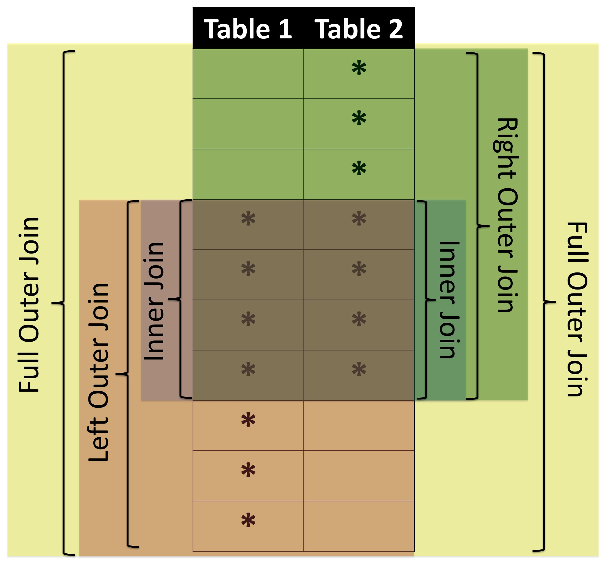

# Week3 Homework Notes
Order of processing SQL

Here's a picture to remind you of the general concepts behind outer joins:

### Some good practices

* Avoid making assumptions about your data or your analyses. For example, rather than assume that all the values in a column are unique just because some documentation says they should be, check for yourself!

* Always look at example outputs of your queries before you strongly interpret aggregate calculations. Take extra care to do this when your queries require joins.

* When your queries require multiple layers of functions or joins, examine the output of each layer or join first before you combine them all together.

* Adopt a healthy skepticsm of all your data and results. If you see something you don't expect, make sure you explore it before interpreting it strongly or incorporating it into other analyses.

### Some point to note

* COUNT DISTINCT does NOT count NULL values
* SELECT/GROUP BY clauses roll up NULL values into one group
