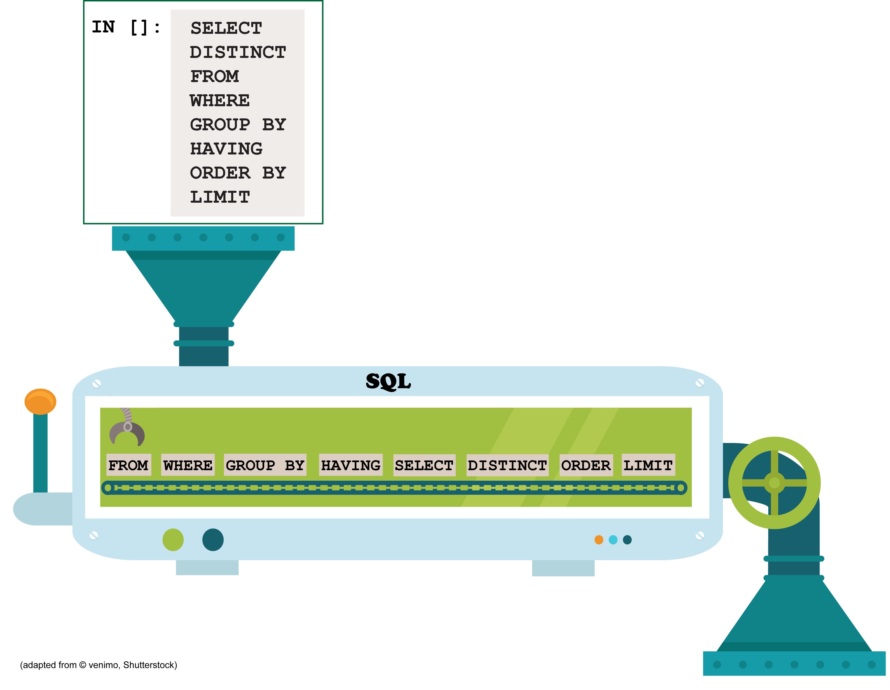

# Week3 Homework Notes
Order of processing SQL


<p align="center">

</p>

### Some good practices

* Avoid making assumptions about your data or your analyses. For example, rather than assume that all the values in a column are unique just because some documentation says they should be, check for yourself!

* Always look at example outputs of your queries before you strongly interpret aggregate calculations. Take extra care to do this when your queries require joins.

* When your queries require multiple layers of functions or joins, examine the output of each layer or join first before you combine them all together.

* Adopt a healthy skepticsm of all your data and results. If you see something you don't expect, make sure you explore it before interpreting it strongly or incorporating it into other analyses.


### Some point to note

* COUNT DISTINCT does NOT count NULL values
* SELECT/GROUP BY clauses roll up NULL values into one group

## Teradata Exercises

### Exercise 1:
(a) Use COUNT and DISTINCT to determine how many distinct skus there are in the skuinfo, skstinfo, and trnsact tables. Which skus are common to all tables, or unique to specific tables?
```
SELECT COUNT(DISTINCT s1.sku)
FROM skuinfo s1;

SELECT COUNT(DISTINCT s1.sku)
FROM skstinfo s1;

SELECT COUNT(DISTINCT s1.sku)
FROM trnsact s1;
```
(b) Use COUNT to determine how many instances there are of each sku associated with
each store in the skstinfo table and the trnsact table?
You should see that there are multiple instances of every sku/store combination in the trnsact
table, but only one instance of every sku/store combination in the skstinfo table. Therefore you
could join the trnsact and skstinfo tables, but you would need to join them on both of the
following conditions: trnsact.sku= kstinfo.sku AND trnsact.store= skstinfo.store.
```
SELECT COUNT(*)
FROM skstinfo s JOIN trnsact t ON t.sku= s.sku AND t.store= s.store

```
68m plus

### Exercise 2:
Use COUNT and DISTINCT to determine how many distinct stores there are in
the strinfo, store_msa, skstinfo, and trnsact tables. Which stores are common to all tables,
or unique to specific tables?
```
SELECT COUNT(DISTINCT store)
FROM strinfo;

SELECT COUNT(DISTINCT store)
FROM store_msa;

SELECT COUNT(DISTINCT store)
FROM skstinfo;

SELECT COUNT(DISTINCT store)
FROM trnsact;

SELECT COUNT(DISTINCT store)
FROM strinfo, store_msa, skstinfo, trnsact
WHERE strinfo.store=store_msa.store
  AND strinfo.store=skstinfo.store
  AND strinfo.store=trnsact;
```

### Exercise 3:
It turns out that there are many skus in the trnsact table that are not skstinfo
table. As a consequence, we will not be able to complete many desirable analyses of
Dillard’s profit, as opposed to revenue, because we do not have the cost information for all
the skus in the transact table. Examine some of the rows in the trnsact table that are not in
the skstinfo table…can you find any common features that could explain why the cost
information is missing?
```
SELECT *
FROM trnsact t LEFT JOIN skstinfo s ON t.sku = s.sku AND t.store= s.store
WHERE s.sku IS NULL
SAMPLE 10;
```

### Exercise 4:
Although we can’t complete all the analyses we’d like to on Dillard’s profit, we
can look at general trends. What is Dillard’s average profit per day?
```
SELECT t.saledate, SUM(t.AMT - s.cost)
FROM trnsact t LEFT JOIN skstinfo s ON t.sku = s.sku AND t.store= s.store
WHERE s.sku IS NOT NULL
GROUP BY t.saledate
ORDER BY t.saledate
```

### Exercise 5:
On what day was the total value (in $) of returned goods the greatest? On what
day was the total number of individual returned items the greatest?
```
SELECT t.saledate, SUM(t.AMT - s.cost)
FROM trnsact t LEFT JOIN skstinfo s ON t.sku = s.sku AND t.store= s.store
WHERE s.sku IS NOT NULL AND t.stype='R'
GROUP BY t.saledate
ORDER BY SUM(t.AMT - s.cost) DESC


SELECT t.saledate, SUM(t.quantity)
FROM trnsact t LEFT JOIN skstinfo s ON t.sku = s.sku AND t.store= s.store
WHERE s.sku IS NOT NULL AND t.stype='R'
GROUP BY t.saledate
ORDER BY SUM(t.AMT - s.cost) DESC
```

### Exercise 6:
What is the maximum price paid for an item in our database? What is the
minimum price paid for an item in our database?
```
SELECT MAX(AMT)
FROM trnsact
WHERE quantity=1;

SELECT MIN(AMT)
FROM trnsact
WHERE quantity=1;
```

### Exercise 7:
How many departments have more than 100 brands associated with them, and
what are their descriptions?
```
SELECT d.dept, d.deptdesc, COUNT(s.brand)
FROM deptinfo d JOIN skuinfo s ON s.dept = d.dept
GROUP BY d.dept, d.deptdesc
HAVING COUNT(s.brand) >= 100
```
### Exercise 8:
Write a query that retrieves the department descriptions of each of the skus in
the skstinfo table.
```
SELECT s1.sku, d.deptdesc
FROM skstinfo s1
  JOIN skuinfo s2 ON s1.sku=s2.sku
  JOIN deptinfo d ON d.dept=s2.dept;
```

### Exercise 9:
What department (with department description), brand, style, and color had
the greatest total value of returned items?
```
SELECT d.deptdesc, d.dept, s.brand, s.color, s.style, COUNT(t.stype)
FROM trnsact t
  JOIN skuinfo s ON t.sku=s.sku
  JOIN deptinfo d ON d.dept=s.dept
WHERE t.stype='R'
GROUP BY d.deptdesc, d.dept, s.brand, s.color, s.style
ORDER BY COUNT(t.stype) DESC
```

### Exercise 10:
In what state and zip code is the store that had the greatest total revenue
during the time period monitored in our dataset?
```
SELECT s.store, s.state, s.zip, SUM(AMT)
FROM strinfo s JOIN trnsact t ON s.store=t.store
GROUP BY s.store, s.state, s.zip
ORDER BY SUM(AMT) DESC
```

### Quiz problem:
In final quiz in week3, there is a questions like "How many states have more than 10 stores?" and it seems to me that the correct answer is not among those 4 options provided.
```
SELECT sm.state, COUNT(DISTINCT sm.store)
FROM store_msa sm
GROUP BY sm.state
HAVING COUNT(DISTINCT sm.store) >= 10
```
